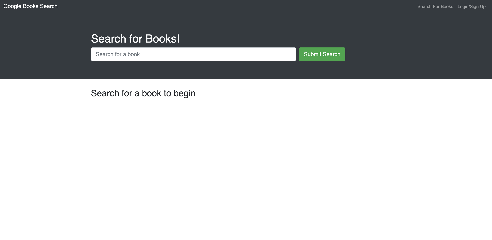
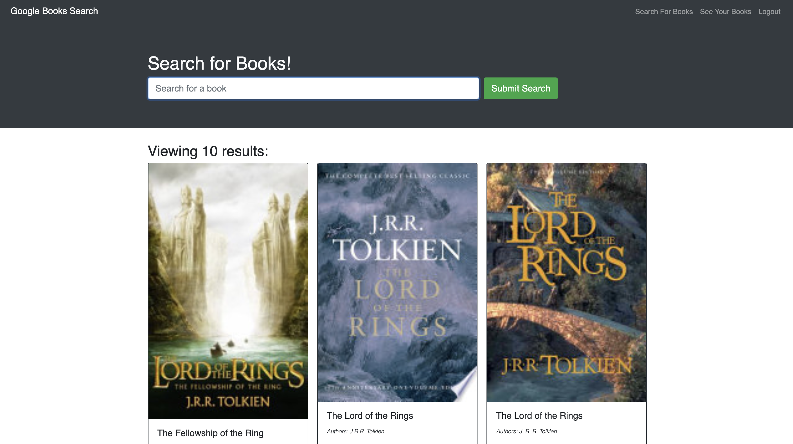

# Book Search Engine (MERN)

## Description

This book search engine application uses the MERN stack to allows users to search by a keyword or keywords and then save books to their library.

The live application is served through [Heroku](https://www.heroku.com/) and is available [HERE](https://infinite-caverns-70429.herokuapp.com/)

### Table of Contents

- [Description](#description)
- [Installation](#installation)
- [License](#license)
- [Contributing](#contributing)
- [Questions](#questions)

### Installation

To install app type `npm i` into the terminal.
It will use the following dependencies:

- MongoDB
- Express
- React
- Node
- GraphQL
- Bootstrap

### App Screen Shots

**Home Page**

**Search Results**

### License

### Questions

For any questions, please feel free to contact me.

- Github Username: [irjaimes](https://github.com/irjaimes/book-search)
- Email : irjaimes@outlook.com
